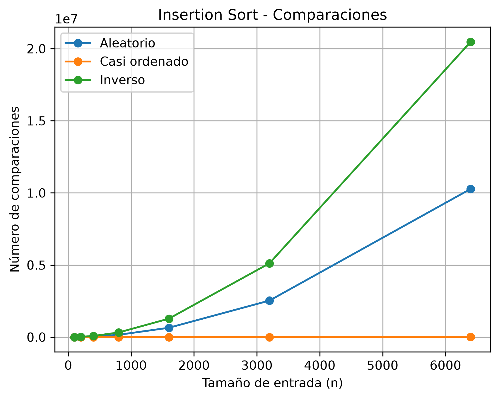
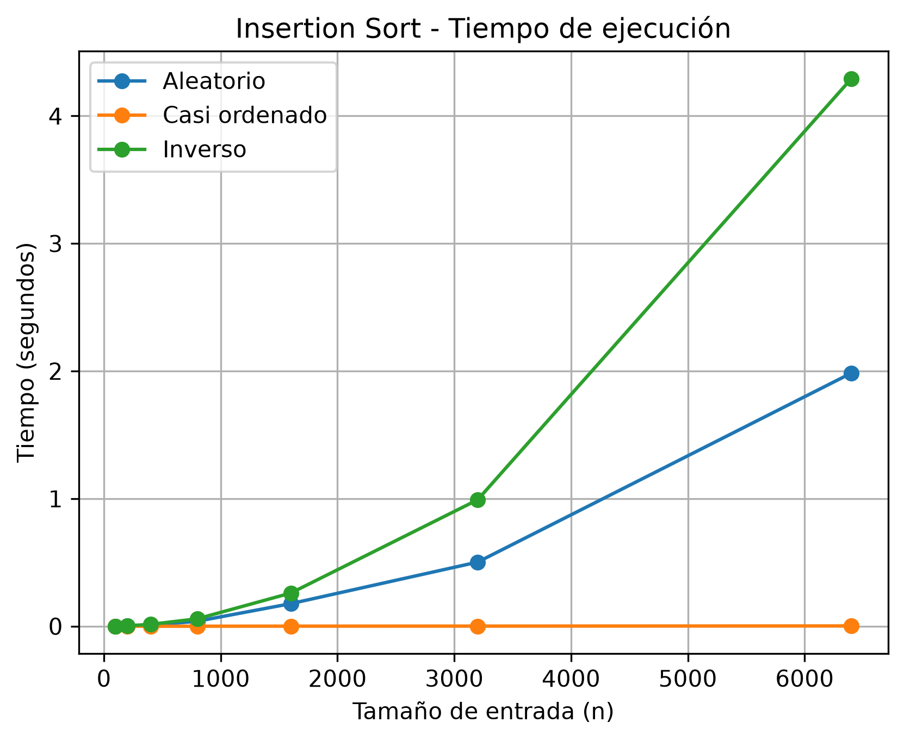

# Laboratorio evaluativo 01 — Fundamentos, complejidad y recurrencias

## Parte 1 — Analizar el algoritmo antes de comprar hardware

La Secretaría está por firmar la compra de un servidor del doble de velocidad para que el proceso de Tamiza quepa en la ventana de cuatro horas. 

### ¿Por qué debe analizarse primero el algoritmo, si el que está en producción lleva ocho años entregando el resultado correcto?

Un algoritmo funciona correctamente cuando cumple con la finalidad con la que se planteo y un algoritmo es eficiente cuando cumple con esa finalidad planteada en un tiempo determinado, en el caso de Tamiza no esta cumpliendo con la eficiencia ya que el algoritmo no culmina su proceso en la ventana de 4 horas.

Duplicar la velocidad del servidor sin antes analizar el algoritmo puede ser un error, ya que si el algoritmo está mal optimizado puede seguir ocurriendo que se incumpla la restricción.

**Otro ejemplo** es una empresa que procesa la cantidad de llamadas que hace cada cliente durante el día, esto puede llegar a ser mas de 2 millones de datos. Este proceso se debe hacer en una ventana de 8 horas, pero el algoritmo, aunque funciona bien no cumple con el proceso en la ventana requerida.

## Parte 2 — Responsabilidad ambiental y ética de la implementación

### Como responsable técnico de Tamiza, ¿qué responsabilidad ambiental y ética asume al decidir qué algoritmo de ordenamiento se ejecuta cada madrugada sobre los datos de 1.200.000 pacientes?

Debido a que se tiene un servidor corriendo el proceso eso se traduce en consumo de energía, y el hecho de que sea un proceso programado para todas las madrugadas implica que el consuma de energía es mayor.

La lentitud del programa afecta a el centro de contacto, ya que al iniciar la jornada no cuentan con la lista completa para realizar las llamadas, en este caso el equipo de desarrollo debe asumir el costo del error ya que debió al mal funcionamiento del programa están perjudicando al centro de contacto. También se ven afectados los pacientes, debido a que puede ocurrir que no sean llamados debido a un error humano de un operador del centro de contacto por hecho de que son demasiados datos, aquí la secretaria debe asumir el costo del error ya que es la responsable principal de que los pacientes sean atendidos de la mejor manera.

Es importante que el ordenamiento sea adecuado ya que de eso depende a quien llamar primero y es delicado ya que el llamado es por índice de riesgo.

## Parte 3 — Peor caso, mejor caso y caso promedio, demostrados en Python

### 3.1 — Explicación

 - El **mejor caso** se da cuando los 1.200.000 registros vienen ya ordenados por índice de riegos de mayor a menor, el **caso promedio**  se cuando vienen ordenados de manera totalmente al azar y el **peor caso** cuando los registro vienen ordenados de menor a mayor riesgo.
 - Para decidir si el algoritmo Tamiza entra en producción hay que usar el peor caso, porque es donde mas se va demorar el algoritmo en realizar el proceso.
 - Predicción: El escenario **A — Aleatorio** = caso promedio, el escenario **B — Casi ordenado** = mejor caso y el escenario **C — Orden inverso** = el peor caso.

### 3.2 — Demostración experimental
#### Comparaciones

#### Tiempo de ejecución

- El escenario C – orden inverso resulto siendo el peor caso, el escenario B – casi ordenado el mejor y el escenario A – aleatorio el que se aproxima al promedio.
- Esto coincido al 100% con mi predicción.