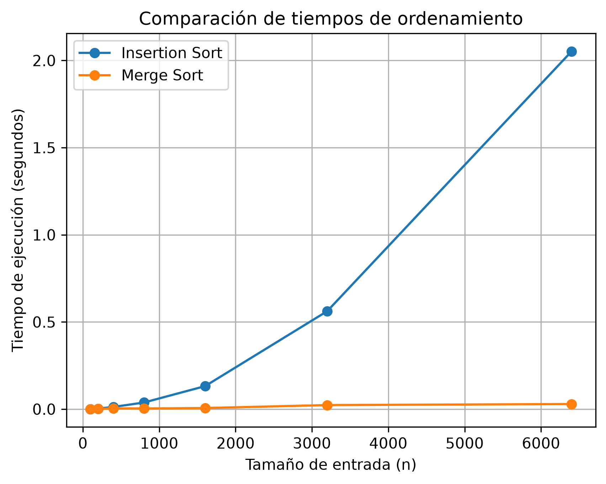

# Laboratorio evaluativo 01 — Fundamentos, complejidad y recurrencias

## Januar Stiwar Martinez Palacios.

Para activar el enton

## Parte 1 — Analizar el algoritmo antes de comprar hardware

La Secretaría está por firmar la compra de un servidor del doble de velocidad para que el proceso de Tamiza quepa en la ventana de cuatro horas. 

### ¿Por qué debe analizarse primero el algoritmo, si el que está en producción lleva ocho años entregando el resultado correcto?

Un algoritmo funciona correctamente cuando cumple con la finalidad con la que se planteo y un algoritmo es eficiente cuando cumple con esa finalidad planteada en un tiempo determinado, en el caso de Tamiza no esta cumpliendo con la eficiencia ya que el algoritmo no culmina su proceso en la ventana de 4 horas.

Duplicar la velocidad del servidor sin antes analizar el algoritmo puede ser un error, ya que si el algoritmo está mal optimizado puede seguir ocurriendo que se incumpla la restricción.

**Otro ejemplo** es una empresa que procesa la cantidad de llamadas que hace cada cliente durante el día, esto puede llegar a ser mas de 2 millones de datos. Este proceso se debe hacer en una ventana de 8 horas, pero el algoritmo, aunque funciona bien no cumple con el proceso en la ventana requerida.

## Parte 2 — Responsabilidad ambiental y ética de la implementación

### Como responsable técnico de Tamiza, ¿qué responsabilidad ambiental y ética asume al decidir qué algoritmo de ordenamiento se ejecuta cada madrugada sobre los datos de 1.200.000 pacientes?

Debido a que se tiene un servidor corriendo el proceso eso se traduce en consumo de energía, y el hecho de que sea un proceso programado para todas las madrugadas implica que el consuma de energía es mayor.

La lentitud del programa afecta a el centro de contacto, ya que al iniciar la jornada no cuentan con la lista completa para realizar las llamadas, en este caso el equipo de desarrollo debe asumir el costo del error ya que debió al mal funcionamiento del programa están perjudicando al centro de contacto. También se ven afectados los pacientes, debido a que puede ocurrir que no sean llamados debido a un error humano de un operador del centro de contacto por hecho de que son demasiados datos, aquí la secretaria debe asumir el costo del error ya que es la responsable principal de que los pacientes sean atendidos de la mejor manera.

Es importante que el ordenamiento sea adecuado ya que de eso depende a quien llamar primero y es delicado ya que el llamado es por índice de riesgo.

## Parte 3 — Peor caso, mejor caso y caso promedio, demostrados en Python

### 3.1 — Explicación

 - El **mejor caso** se da cuando los 1.200.000 registros vienen ya ordenados por índice de riegos de mayor a menor, el **caso promedio**  se cuando vienen ordenados de manera totalmente al azar y el **peor caso** cuando los registro vienen ordenados de menor a mayor riesgo.
 - Para decidir si el algoritmo Tamiza entra en producción hay que usar el peor caso, porque es donde mas se va demorar el algoritmo en realizar el proceso.
 - Predicción: El escenario **A — Aleatorio** = caso promedio, el escenario **B — Casi ordenado** = mejor caso y el escenario **C — Orden inverso** = el peor caso.

### 3.2 — Demostración experimental

[código de la Parte 3](parte3_casos.py)

Los generadores utilizados para construir los escenarios de prueba
se encuentran en [datos.py](datos.py), mientras que los algoritmos
de ordenamiento se encuentran en [algoritmos.py](algoritmos.py).

#### Comparaciones


#### Tiempo de ejecución


- El escenario C – orden inverso resulto siendo el peor caso, el escenario B – casi ordenado el mejor y el escenario A – aleatorio el que se aproxima al promedio.
- Esto coincide al 100% con mi predicción.

## Parte 4 — Complejidad de merge sort e insertion sort: cálculo y validación

### 4.1 — Cálculo teórico

#### Planteamiento de la recurrencia de Merge Sort y resolución por método de sustitución

$$
T(n)=2T\left(\frac{n}{2}\right)+O(n)
$$

- $2T(n/2)$ = costo de la recursividad.
- $O(n)$ = hace referencia a una función de costo lineal.

#### Método de sustitución

Partimos de:

$$
T(n)=2T\left(\frac{n}{2}\right)+O(n)
$$

Reemplazamos $O(n)$ por $cn$:

$$
T(n)=2T\left(\frac{n}{2}\right)+cn
$$

**Hipótesis:**

$$
T(n)\leq cn\log n
$$

Entonces:

$$
T\left(\frac{n}{2}\right)
\leq
c\frac{n}{2}\log\left(\frac{n}{2}\right)
$$

Sustituimos:

$$
T(n)
\leq
2\left[
c\frac{n}{2}\log\left(\frac{n}{2}\right)
\right]+cn
$$

Simplificando:

$$
T(n)
\leq
cn\log\left(\frac{n}{2}\right)+cn
$$

Por lo tanto:

$$
T(n)
\leq
cn(\log n-\log 2)+cn
$$

Entonces:

$$
T(n)
\leq
cn\log n-cn\log 2+cn
$$

Como $\log_2 2=1$:

$$
T(n)
\leq
cn\log n-cn+cn
$$

Finalmente:

$$
T(n)\leq cn\log n
$$

Por lo tanto:

$$
\boxed{T(n)=O(n\log n)}
$$

---

### Cota manual de Insertion Sort

La expresión de la complejidad es:

$$
T(n) = C_1n + C_2(n-1) + C_3(n-1) + C_4\sum_{i=1}^{n-1}(t_i+1) + C_5\sum_{i=1}^{n-1}t_i + C_6\sum_{i=1}^{n-1}t_i + C_7(n-1)
$$

Agrupando términos:

$$
T(n) = C_1n + (n-1)(C_2+C_3+C_4+C_7) + (C_4+C_5+C_6) \sum_{i=1}^{n-1}t_i
$$

En el peor caso, los datos están en **orden inverso**:

$$
t_i=i
$$

Por lo tanto:

$$
\sum_{i=1}^{n-1}i = \frac{n(n-1)}{2}
$$

Sustituimos:

$$
T(n) = C_1n + (C_2+C_3+C_4+C_7)(n-1) + (C_4+C_5+C_6) \frac{n^2-n}{2}
$$

El término dominante es:

$$
n^2
$$

Por lo tanto:

$$
\boxed{T(n)=O(n^2)}
$$

---

### Complejidad esperada de cada algoritmo

| Algoritmo | Mejor caso | Caso promedio | Peor caso |
|---|---|---|---|
| **Insertion Sort** | $O(n)$ | $O(n^2)$ | $O(n^2)$ |
| **Merge Sort** | $O(n\log n)$ | $O(n\log n)$ | $O(n\log n)$ |

### 4.2 — Validación experimental

[código de la Parte 4](parte4_complejidad.py)

Para esta parte se utilizan los algoritmos definidos en
[algoritmos.py](algoritmos.py) y los datos generados mediante
[datos.py](datos.py).

#### Comparación de tiempos de Insertion Sort y Merge Sort


En la gráfica se observa que el tiempo de ejecución de Insertion Sort
aumenta más rápidamente a medida que crece el tamaño de entrada,
mientras que Merge Sort presenta un crecimiento más moderado.

Esto coincide con las complejidades analizadas anteriormente:
Insertion Sort tiene una complejidad promedio de O(n²), mientras que
Merge Sort tiene una complejidad de O(n log n).

Para tamaños pequeños pueden presentarse diferencias distintas a las
esperadas debido a los costos constantes de cada implementación y al
ruido propio de la medición del tiempo. A medida que aumenta el tamaño
de entrada, el comportamiento asintótico se hace más evidente.

### 4.3 — Concepto técnico a la Secretaría de Salud

Para Tamiza se recomienda utilizar Merge Sort como único algoritmo de ordenamiento, debido a que el canal de entrada puede cambiar sin aviso entre registros aleatorios, casi ordenados u ordenados de forma inversa. El criterio utilizado para resolver este compromiso es priorizar un comportamiento de desempeño más consistente frente a diferentes distribuciones de entrada y, al mismo tiempo, evitar el mantenimiento de tres implementaciones especializadas. Esta decisión está respaldada por las mediciones realizadas y no únicamente por la complejidad teórica.

En la medición con 6.400 registros, sobre el escenario A, Insertion Sort presentó un tiempo de 2,05230310 segundos, mientras que Merge Sort presentó 0,02925640 segundos, según la gráfica parte4_tiempo.png. Esto significa que, para ese tamaño, la ejecución medida de Insertion Sort tomó aproximadamente 70 veces más tiempo que Merge Sort. Además, al aumentar el tamaño de entrada desde 100 hasta 6.400 registros, la curva de Insertion Sort creció de forma mucho más pronunciada, mientras que Merge Sort mantuvo un crecimiento considerablemente menor. Este comportamiento coincide con las complejidades calculadas: O(n²) para Insertion Sort en el caso promedio y O(n log n) para Merge Sort.

Para estimar el comportamiento con 1.200.000 registros, se utiliza como punto de referencia la medición de 6.400 registros. Para Insertion Sort, el factor de crecimiento cuadrático es aproximadamente 35.156 veces, por lo que los 2,05230310 segundos medidos se traducen en una estimación de aproximadamente 72.151 segundos, es decir, 20 horas. Para Merge Sort se utiliza el crecimiento proporcional de n log n; el factor aproximado entre 6.400 y 1.200.000 registros es 299,5, dando una estimación de aproximadamente 8,76 segundos. Estas cifras son estimaciones por extrapolación, no mediciones directas con 1.200.000 registros, y suponen condiciones de ejecución comparables y que el costo relevante corresponde al ordenamiento.

Respecto a la propuesta de adquirir un servidor con el doble de velocidad, los datos medidos no justifican utilizar el hardware como sustituto de una mejora algorítmica. Si se asumiera idealmente que duplicar la velocidad reduce el tiempo a la mitad, la estimación de Insertion Sort pasaría de aproximadamente 20 horas a 10 horas, todavía por encima de la ventana de cuatro horas. Merge Sort pasaría aproximadamente de 8,76 a 4,38 segundos, aunque esta última cifra ya se encuentra muy por debajo de la ventana requerida. Por tanto, los resultados indican que la complejidad del algoritmo tiene un impacto mucho mayor que simplemente duplicar la capacidad de cómputo.

También debe considerarse la memoria. Merge Sort requiere memoria adicional para almacenar las listas temporales durante la división y combinación, mientras que Insertion Sort puede trabajar sobre una copia con un uso adicional menor. Sin embargo, el costo de memoria debe evaluarse junto con el volumen real de 1.200.000 registros y los recursos disponibles. Además, mantener una única implementación de Merge Sort reduce la complejidad de mantenimiento y evita depender de que el escenario B permanezca casi ordenado. Esto proporciona un comportamiento más predecible si cambia el flujo de reproceso de Tamiza.

## Instrucciones para reproducir el experimento

### 1. Crear y activar el entorno virtual
Desde la carpeta raíz del proyecto:

```powershell
python -m venv .venv
.\.venv\Scripts\Activate.ps1
pip install matplotlib

Ejecutar parte 3
python parte3_casos.py

Ejecutar parte 4
python parte3_casos.py